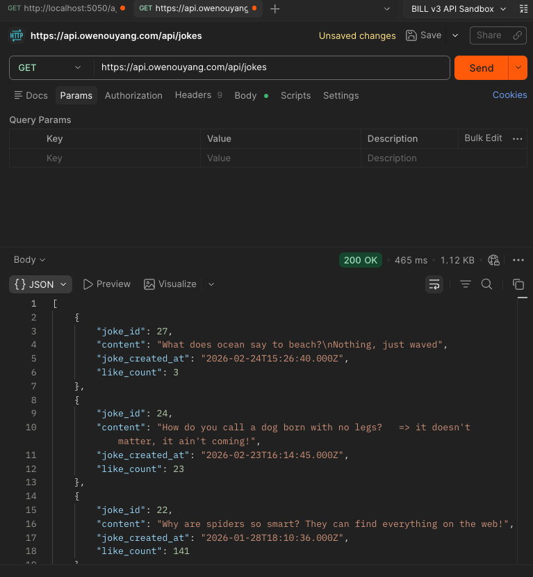
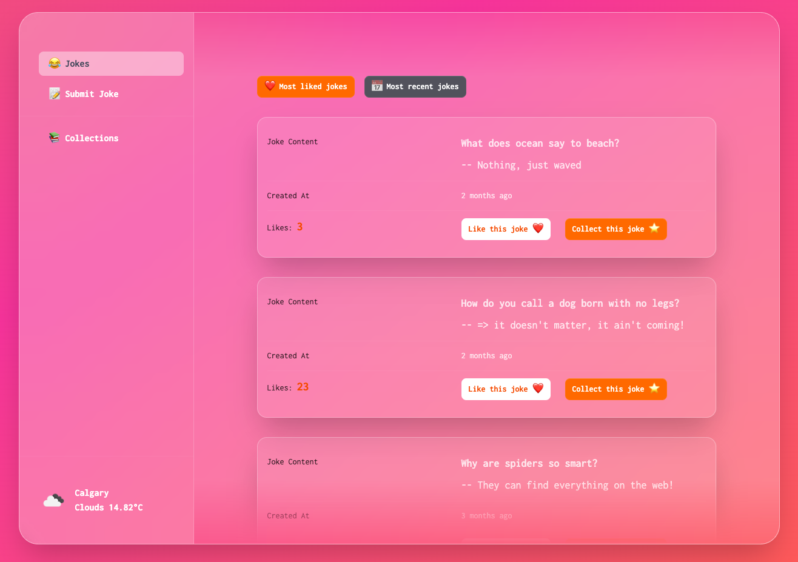

# Jokes Share (Backend)

Backend for **Jokes Share**, a small web app for browsing, liking, and submitting jokes. This repository contains the RESTful API that powers the React frontend application and handles joke data, likes, and database communication.

## Live API & Live Site

[https://api.owenouyang.com/api/jokes](https://api.owenouyang.com/api/jokes)

<p align="left">
  
</p>

[https://owenouyang.com](https://owenouyang.com)

<p align="left">
  
</p>

## Overview

This backend was built as the server-side service for the Jokes Share project. It focuses on core full-stack concepts such as API routing, controllers, database operations, middleware, and client-server integration.

## Features

- **Jokes feed API** — Return jokes data for frontend display, including content, likes, and created date.
- **Create jokes** — Accept new joke submissions and store them in the database.
- **Like jokes** — Increment likes for selected jokes.
- **RESTful endpoints** — Clean API structure for frontend integration.
- **Middleware support** — JSON parsing, CORS, and centralized error handling.
- **Database integration** — Persistent joke storage with SQL queries.

## Tech stack

- [Node.js](https://nodejs.org/)
- [Express.js](https://expressjs.com/)
- [MySQL](https://www.mysql.com/)
- [dotenv](https://www.npmjs.com/package/dotenv)
- [cors](https://www.npmjs.com/package/cors)
- [nodemon](https://www.npmjs.com/package/nodemon)

## Prerequisites

- **Node.js** (current LTS recommended)
- Running **MySQL database**
- npm

## Configuration

Create a `.env` file in the project root and set:

| Variable      | Description              | Default                 |
| ------------- | ------------------------ | ----------------------- |
| `PORT`        | Server port              | `3000`                  |
| `DB_HOST`     | Database host            | `localhost`             |
| `DB_USER`     | Database username        | `root`                  |
| `DB_PASSWORD` | Database password        | `yourpassword`          |
| `DB_NAME`     | Database name            | `jokes_share`           |
| `CLIENT_URL`  | Frontend origin for CORS | `http://localhost:5173` |

## API Endpoints

The server provides a REST API with at least:

- `GET /api/jokes` — Returns all jokes.
- `POST /api/jokes` — Body: `{ "content": "..." }` — Creates a joke.
- `POST /api/jokes/:jokeId/like` — Increments the like count for a joke.

## Scripts

```bash
npm install
npm run dev      # start server with nodemon
npm start        # start production server
```
